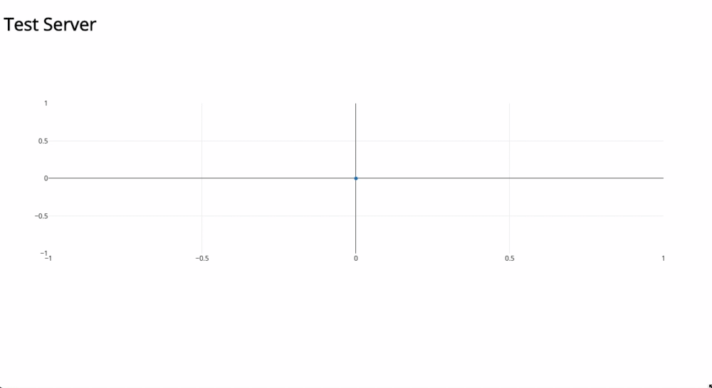

# LiveUpdate
Real time updating single connection data chart. Built for my projects using Raspberry Pi. Meant to be used for development, not production.

Currently using a random number generator to generate fake data, which is then sent to the frontend where it is graphed. I made this to interface with my Raspberry Pi and be able to read sensor data.

## Technologies Used:
- Websockets
- Python
- JavaScript

## Demo:

